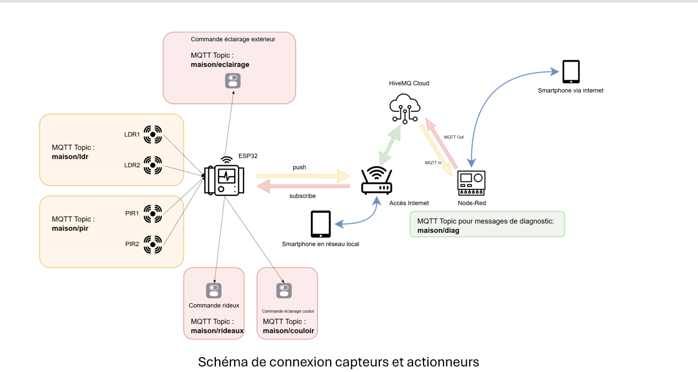
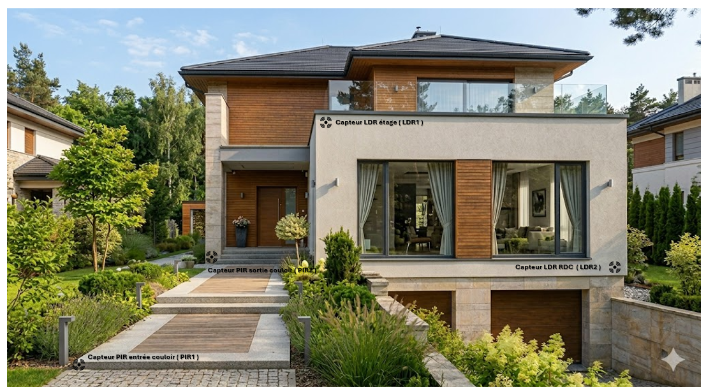
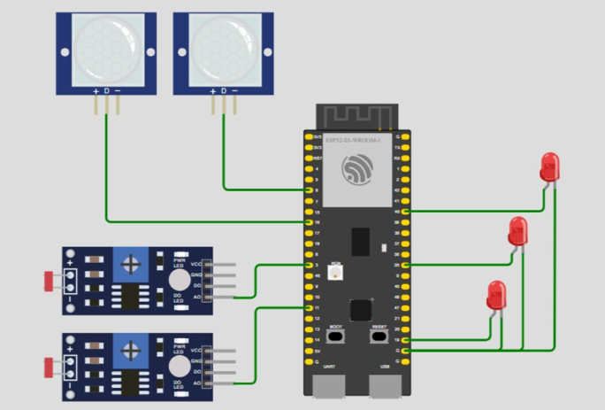
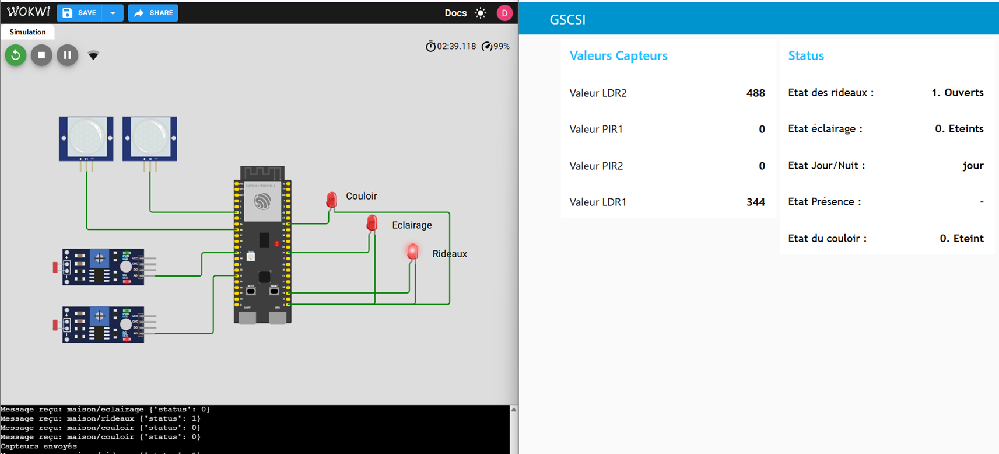
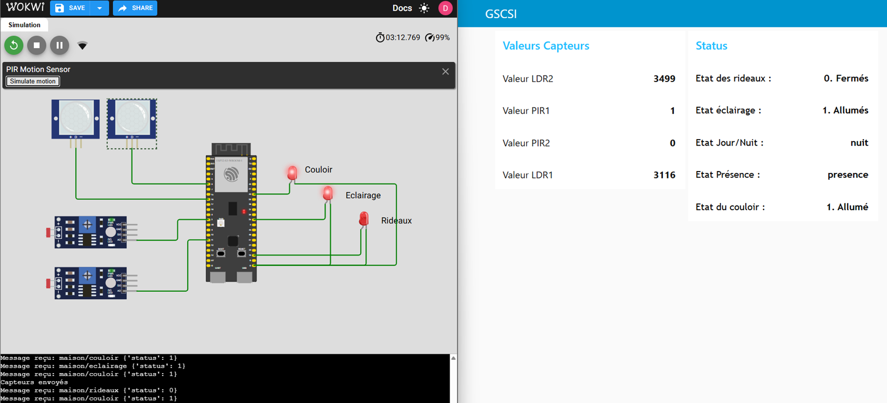

# Smart Home Automation using ESP32, MQTT and Node-RED

## Overview

This project implements a Smart Home Automation System based on ESP32, MQTT, HiveMQ Cloud, and Node-RED.

The system automatically controls:

- Smart curtains using LDR sensors
- Corridor lighting using LDR and PIR sensors
- Manual control through Node-RED dashboard

## Technologies Used

- ESP32
- MicroPython
- MQTT
- HiveMQ Cloud
- Node-RED
- Wokwi Simulator

## System Architecture

Sensors → ESP32 → MQTT Broker (HiveMQ Cloud) → Node-RED → Commands → ESP32 → Actuators

## Sensors

### LDR Sensors
- Ambient light detection
- Day/Night recognition

### PIR Sensors
- Motion detection
- Automatic lighting control

## Features

- Automatic curtain control
- Automatic corridor lighting
- Real-time MQTT communication
- Remote monitoring
- Dashboard visualization
- Manual and automatic modes

## MQTT Topics

### Published Topics

- maison/ldr
- maison/pir

### Subscribed Topics

- maison/eclairage
- maison/rideaux

## Project Workflow

1. Sensor data acquisition
2. MQTT publication
3. Node-RED processing
4. Decision making
5. Command generation
6. Actuator control

## Simulation

The project was developed and tested using:

- ESP32 Simulator (Wokwi)
- HiveMQ Cloud
- Node-RED Dashboard
## Project Screenshots

### System Architecture

### Sensor Positioning

### Node-RED Flow

### ESP32 Simulation

### Day Mode Test

### Night Mode Test

### Motion Detection Test

## Project Presentation

The complete project presentation is available in:

📄 Smart_Home_Automation_Presentation.pdf

## Author

Maha Fadil  
Cybersecurity & Network Engineering Student
